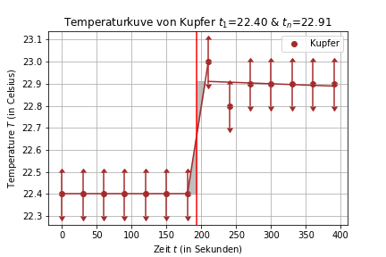
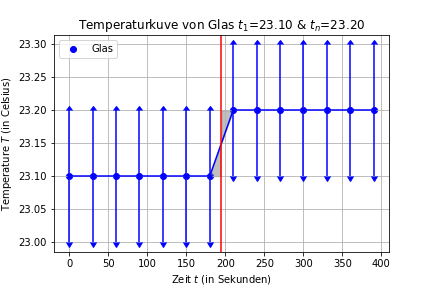
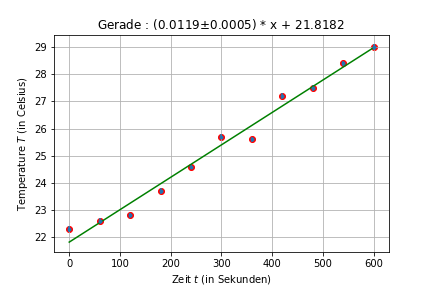
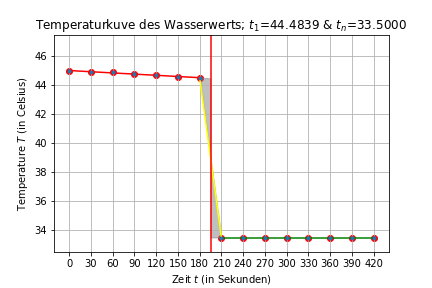
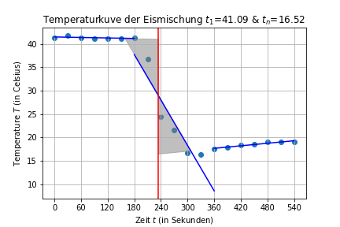
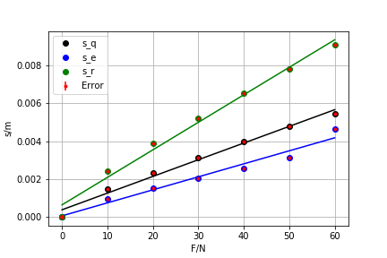
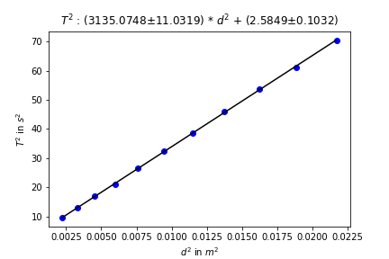

# python
## M15 Harmonische Schwingungen von Physikalischen und gekoppelten Pendeln <!-- 2.0 -->
Allgemeine Fits mit <code>scipy.stats.linregress</code> als auch ein Fit mit `lmfit`(linkes bild) welches sehr fortgeschritten ist (Zur installation in Anaconda3: `conda install -c conda-forge lmfit`). <a href="Experiment_M15/m15.pdf">PDF Protokoll M15</a>  

  
   
  
  

  
<h2> T3 Bestimmung der spezifischen Wärmekapazität und Schmelzwärme </h2>  <!-- 1.7  -->
Allgemeine Fits mit <code>scipy.stats.linregress</code> wobei es eine Vor- und Nachkurve gab welche in Kombination der Optimierung einer Fläche <code>scipy.optimize</code> ein genaueres Ergebnis lieferten. <a href="Experiment_T3/t3.pdf">PDF Protokoll T3</a>  

  
   
  
  
  
  

<h2> M3 Bestimmung des Elastizitätsmoduls durch Biegung und dynamische Bestimmung des Torsionsmoduls </h2>  <!-- 2.3  -->
Allgemeine Fits mit <code>scipy.stats.linregress</code> und simple Fehlerrechnung. <a href="Experiment_M3/m3.pdf">PDF Protokoll M3</a>  

  
   

<h2> GO1 Abbildungen durch Linsen und Abbildungsfehler </h2>  <!-- 2.3  -->
Eine Vielzahl an Rechnungen und Ausgabe von Werten. <a href="Experiment_GO1/go1.pdf">PDF Protokoll GO1</a>  
<h2> GO2 Optische Instrumente </h2>  <!-- NUL -->
Keine EDV notwendig gewesen. <a href="Experiment_GO2/GO2.pdf">PDF Protokoll GO2</a>  
<h2> InfoStat/Einführung in die Statistik und angewandte Informatik </h2>
Simulation des Simulation des Rutherford-Geiger-Experimentes und Bestätigung der unterliegenden Vermutung einer Possion-Verteilung(N &rarr; &infin; &rArr; Possion-Verteilung)
