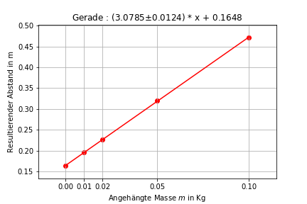

# python
## M15 Harmonische Schwingungen von Physikalischen und gekoppelten Pendeln
Allgemeine Fits mit <code>scipy.stats.linregress</code> als auch ein Fit mit `lmfit`(linkes bild) welches sehr fortgeschritten ist (Zur installation in Anaconda3: `conda install -c conda-forge lmfit`)[PDF Protokoll](Experiment_M15/m15.pdf)

  
   
  
  

