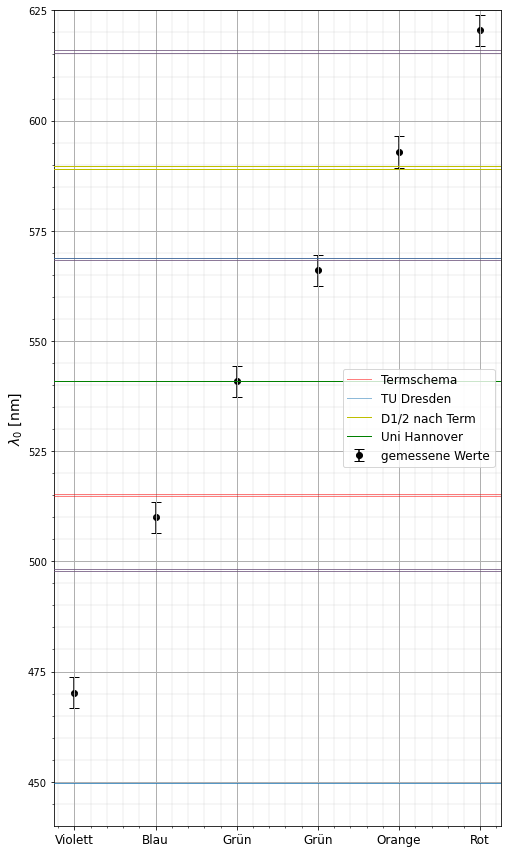

# Resultate aus dem Buch 'Physik mit Python'
Physik mit Python fängt ganz vorne an(bezogen auf Python) und befasst sich mit allen Problemstellungen, welche man sich im Zusammenhang mit der Physik vorstellen kann.
Ab dem zweiten Kapitel gibt es stets eine Handvoll Aufgaben, welche meist auf in diesem Kapitel vorgestellten Programmen und Konzepten beruhen. Im Folgenden sind die jeweils interessante und visuell ansprechende Ergebnis der Aufgaben präsentiert.

## Kapitel 2: Einführung in Python
i) Primzahlfindung mittels des Algoritmus 'Sieb des Eratosthenes'. Das gif zeigt die Funktionsweise(von Wikipedia)  
ii) Erzeugung einer Rechteckwelle durch überlagerung von Sinus Wellen  
iii) effizente Flächenberechnung eines Polygon  

  
  
  

  

## Kapitel 3: Physikalische Größen und Messungen
i) Fit an 𝐹 =𝑏|𝑣|^𝑛 mit `scipy.optimize.curve_fit`  
ii) Fit an 𝐴=𝐴0*𝑓0^2/sqrt((𝑓^2−𝑓0^2)^2+(𝛿𝑓/𝜋)^2) mit `scipy.optimize.curve_fit` und berücksichtigung der Fehler  

  
  

  

## Kapitel 4: Kinematik des Massenpunkts
i) "Hundekurve" mit modifizierten Anfangsbedingungen (Der Mensch bewegt sich kontinuierlich im Kreis während der Hund stehts auf den Menschen direkt zuläuft)
ii) "Hundekurve", wobei das Boot direkt auf das Ziel zusteuert jedoch von der Strömung beeinflusst wird
iii) Simulation eines Fadenspendel mit Kleinwinkelnäherung
iv) Simulation des "Affenschuss"

  
  
  
  

  

# Versuchsausvertungen Uni:
## M15 Harmonische Schwingungen von Physikalischen und gekoppelten Pendeln <!-- 2.0 -->
Allgemeine Fits mit <code>scipy.stats.linregress</code> als auch ein Fit mit `lmfit`(rechtes bild) welches sehr fortgeschritten ist (Zur installation in Anaconda3: `conda install -c conda-forge lmfit`). <a href="Laborpraktika/Experiment_M15/m15.pdf">PDF Protokoll M15</a>  

  
   
  
  

  

<h2> T3 Bestimmung der spezifischen Wärmekapazität und Schmelzwärme </h2>  <!-- 1.7  -->
Allgemeine Fits mit <code>scipy.stats.linregress</code> wobei es eine Vor- und Nachkurve gab welche in Kombination der Optimierung einer Fläche <code>scipy.optimize</code> ein genaueres Ergebnis lieferten. <a href="Laborpraktika/Experiment_T3/t3.pdf">PDF Protokoll T3</a>  

  
   
  
  
  
  

<h2> M3 Bestimmung des Elastizitätsmoduls durch Biegung und dynamische Bestimmung des Torsionsmoduls </h2>  <!-- 2.3  -->
Allgemeine Fits mit <code>scipy.stats.linregress</code> und simple Fehlerrechnung. <a href="Laborpraktika/Experiment_M3/m3.pdf">PDF Protokoll M3</a>  

  
   

<h2> GO1 Abbildungen durch Linsen und Abbildungsfehler </h2>  <!-- 2.3  -->
Eine Vielzahl an Rechnungen und Ausgabe von Werten. <a href="Experiment_GO1/go1.pdf">PDF Protokoll GO1</a>  

<h2> GO2 Optische Instrumente </h2>  <!-- NUL -->
Keine EDV notwendig gewesen. <a href="Experiment_GO2/GO2.pdf">PDF Protokoll GO2</a>  

<h2> E2 Messung  von  Magnetfeldern mit der Hallsonde </h2> <!-- 1.7  -->
Alle fits `lmfit` erstellt. Zudem ein Python-Programm erstellt welches numpy arrays in eine Latex Tabelle umwandelt (nicht im Skript verwendet)<a href="Laborpraktika/Experiment_E2/E2.pdf">PDF Protokoll E2</a>

  
  
  
   

<h2> AP1 Messung der Elementarladung - Der Millikan'sche Öltröpfchenversuch</h2><!-- 1.3  -->
Manuelle analyse eines Histogrammes und lineare regression mit `scipy.odr` wobei eine Funktion erstellt worden ist zur automatischen regression und Darstellung. Zusätzlich wurde eine Funktion geschrieben zur Erstellung von mehrseitigen Latextabellen. <a href="Laborpraktika/Experiment_AP1/AP1.pdf">PDF Protokoll AP1</a>

  
  
  

<h2> AP2 Bestimmung des Planck'schen Wirkungsquantums - Der photoelektrische Effekt </h2><!-- 1.3  -->
Überprüfung von Thesen und Konstanten basierend auf den Plots der ODR Funktion. Die Latextabellenfunktion wurde zudem erweitert zur Unterstüzung von verschieden Datentypen, Kontrolle von Eingabeparametern und Unterstüzung von shortcuts. <a href="Laborpraktika/Experiment_AP2/AP2.pdf">PDF Protokoll AP2</a>

  
  
  
  

<h2> AP4 Inelastische Streuung - Das Franck-Hertz-Experiment </h2><!-- 2.7  -->
Lineare regressionen mit der ODR Funktion und grafische Bearbeitung eines Bildes mit `matpltlib`. <a href="Laborpraktika/Experiment_AP4/AP4.pdf">PDF Protokoll AP4</a>

  
  
  

<h2> AP9 Ablenkung und Beugung von Elektronen </h2> <!-- 2.3  -->
Korrelationüberprüfungen mit der ODR Funktion zum beweisen des Welle-Teilchen-Dualismus.<a href="Laborpraktika/Experiment_AP9/AP9.pdf">PDF Protokoll AP9</a>

  
  
  

<h2> AS1 Atomspektren </h2> <!-- 1.0  -->
Analyse der Spektrallinien von Wasserstoff und Natrium als auch bestimmung von einer Naturkonstante. Die ODR Funktion ist nun ausgelagert worden wobei auf backwards compatibility geachtet worden ist. <a href="Laborpraktika/Experiment_AS1/AS1.pdf">PDF Protokoll AS1</a>

  
  
  

<h2> EP2 Diode </h2>
Aufnehmen von Kennlinien und Darstellung in Python unter Verwendung verschiedener Achsenskalierungen(linear/logarithmisch). <a href="Laborpraktika/Experiment_EP2/EP2_Jahns_Adam.pdf">PDF Protokoll EP2</a>

  
  
  

<h2> EP3 Transistor </h2>
Aufnehmen von Kennlinien und Darstellung in Python als auch einfache Fits . <a href="Laborpraktika/Experiment_EP3/EP3_Jahns_Adam.pdf">PDF Protokoll EP2</a>

<h1> Modul: InfoStat/Einführung in die Statistik und angewandte Informatik </h1> <!-- 1.7  -->
Simulation des Simulation des Rutherford-Geiger-Experimentes und Bestätigung der unterliegenden Vermutung einer Possion-Verteilung (N &rarr; &infin; &rArr; Possion-Verteilung). Es wurde einfach, in einer .ipynb Datei, implementiert als auch unter Verwendung von Multithreading welches eine weitere selbsterstellte .py Datei benötigte.<a href="InfoStat/Simulation_des_Rutherford_Geiger_Experimentes.pdf">PDF Abgabe</a>

  
  
  
  

